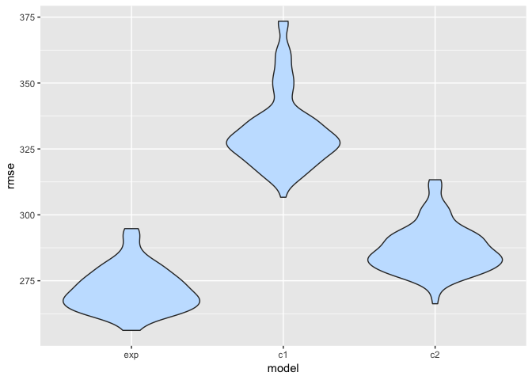

P8105\_hw6\_ym2715
================
Yizhi Ma
11/27/2018

Problem 1
---------

Load data from github and do some cleaning

``` r
homi_raw = read_csv("https://raw.githubusercontent.com/washingtonpost/data-homicides/master/homicide-data.csv")

homi = homi_raw 
homi$city_state = paste(homi$city, homi$state, sep = ", ")
homi = homi %>% 
  select(-city, -state) %>% 
  filter(city_state != "Dallas, TX",
         city_state != "Phoenix, AZ",
         city_state != "Kansas City, MO",
         city_state != "Tulsa, AL") %>% 
  mutate(victim_race = case_when(victim_race == "White" ~ "white",
                                 TRUE ~ "non-white"),
         victim_race = fct_relevel(victim_race, ref = "white"),
         victim_age = as.numeric(victim_age))
```

Logistic regression in Baltimore, MD

``` r
balto_glm = homi %>% 
  filter(city_state == "Baltimore, MD") %>% 
  mutate(disposition = case_when(disposition == "Closed by arrest" ~ 1,
                                 TRUE ~ 0))%>% 
  glm(disposition ~ victim_age + victim_sex + victim_race, data = ., family = binomial())

balto_glm %>% broom::tidy(conf.int = TRUE)
```

    ## # A tibble: 4 x 7
    ##   term            estimate std.error statistic  p.value conf.low conf.high
    ##   <chr>              <dbl>     <dbl>     <dbl>    <dbl>    <dbl>     <dbl>
    ## 1 (Intercept)      1.19      0.235        5.06 4.30e- 7   0.730   1.65    
    ## 2 victim_age      -0.00699   0.00326     -2.14 3.22e- 2  -0.0134 -0.000627
    ## 3 victim_sexMale  -0.888     0.136       -6.53 6.80e-11  -1.16   -0.622   
    ## 4 victim_racenon… -0.820     0.175       -4.69 2.68e- 6  -1.16   -0.479

Calculate odds ratio and CI in Baltimore, MD

``` r
balto_or_ci = balto_glm %>% 
  broom::tidy(conf.int = TRUE) %>% 
  mutate(odds_ratio = exp(estimate),
         conf_lower = exp(conf.low),
         conf_upper = exp(conf.high)) %>% 
  select(term, odds_ratio, conf_lower, conf_upper) %>% 
  filter(term == "victim_racenon-white")

balto_or_ci
```

    ## # A tibble: 1 x 4
    ##   term                 odds_ratio conf_lower conf_upper
    ##   <chr>                     <dbl>      <dbl>      <dbl>
    ## 1 victim_racenon-white      0.441      0.312      0.620

As the results shows, the adjusted odds ratio for homicides with non-white victim in Baltimore, MD that a solved is 0.441 times the odds ratio of those with white victim. The 95% CI for this result is 0.312 to 0.620.

Logistic regression for each city

``` r
each_city_glm = homi %>% 
  mutate(disposition = case_when(disposition == "Closed by arrest" ~ 1,
                                 TRUE ~ 0))%>% 
  group_by(city_state) %>% 
  nest() %>% 
  mutate(model = map(data, ~glm(disposition ~ victim_age + victim_race + victim_sex, 
                                    data = ., family = binomial())),
         model_ci = map(model, broom::confint_tidy),
         model_tidy = map(model, broom::tidy)) %>% 
  select(-data, -model) %>% 
  unnest() %>% 
  filter(term == "victim_racenon-white") %>% 
  mutate(odds_ratio = exp(estimate), conf.low = exp(conf.low), conf.high = exp(conf.high)) %>% 
  select(city_state, odds_ratio, conf.low, conf.high)
```

Plot showing the regression results

``` r
each_city_glm %>% 
  arrange(odds_ratio) %>% 
  mutate(city_state = factor(city_state, unique(city_state))) %>% 
  ggplot(aes(x = city_state, y = odds_ratio)) +
  geom_point(alpha = 0.8) +
  geom_errorbar(aes(ymin = conf.low, ymax = conf.high), alpha = 0.4) +
  coord_flip() +
  labs(
    title = "Odds ratio and CIs for solved homicide cases in each city",
    x = "City, State",
    y = "Odds ratio (non-white vs white) and Confidence interval",
    caption = "data from The Washington Post "
  ) +
  theme_bw()+
  theme(axis.text.y = element_text(size = 6, hjust = 1)) 
```


It seems in Boston that non-white people are least likely to be the victim of a solved homicide case.

Problem 2
---------

Load data from website and do some cleaning

``` r
birthweight_raw = read_csv("http://p8105.com/data/birthweight.csv")

birthweight_tidy = 
  birthweight_raw %>% 
  select(bwt, everything()) %>% 
  mutate(babysex = as.factor(case_when(babysex == 1 ~ "male",
                                       babysex == 2 ~ "female")),
         frace = as.factor(frace),
         mrace = as.factor(mrace),
         frace = recode(frace,
                        "1" = "White", "2" = "Black", "3" = "Asian", "4" = "Puerto Rican", "8" = "Other", "9" = "Unknown"),
         mrace = recode(mrace,
                        "1" = "White", "2" = "Black", "3" = "Asian", "4" = "Puerto Rican", "8" = "Other"))
```

Using stepwise to build model.

``` r
myfit = lm(bwt ~ ., data = birthweight_tidy)

step(myfit, direction = 'backward')
```

    ## Start:  AIC=48717.83
    ## bwt ~ babysex + bhead + blength + delwt + fincome + frace + gaweeks + 
    ##     malform + menarche + mheight + momage + mrace + parity + 
    ##     pnumlbw + pnumsga + ppbmi + ppwt + smoken + wtgain
    ## 
    ## 
    ## Step:  AIC=48717.83
    ## bwt ~ babysex + bhead + blength + delwt + fincome + frace + gaweeks + 
    ##     malform + menarche + mheight + momage + mrace + parity + 
    ##     pnumlbw + pnumsga + ppbmi + ppwt + smoken
    ## 
    ## 
    ## Step:  AIC=48717.83
    ## bwt ~ babysex + bhead + blength + delwt + fincome + frace + gaweeks + 
    ##     malform + menarche + mheight + momage + mrace + parity + 
    ##     pnumlbw + ppbmi + ppwt + smoken
    ## 
    ## 
    ## Step:  AIC=48717.83
    ## bwt ~ babysex + bhead + blength + delwt + fincome + frace + gaweeks + 
    ##     malform + menarche + mheight + momage + mrace + parity + 
    ##     ppbmi + ppwt + smoken
    ## 
    ##            Df Sum of Sq       RSS   AIC
    ## - frace     4    124365 320848704 48712
    ## - malform   1      1419 320725757 48716
    ## - ppbmi     1      6346 320730684 48716
    ## - momage    1     28661 320752999 48716
    ## - mheight   1     66886 320791224 48717
    ## - menarche  1    111679 320836018 48717
    ## - ppwt      1    131132 320855470 48718
    ## <none>                  320724338 48718
    ## - fincome   1    193454 320917792 48718
    ## - parity    1    413584 321137922 48721
    ## - mrace     3    868321 321592659 48724
    ## - babysex   1    853796 321578134 48727
    ## - gaweeks   1   4611823 325336161 48778
    ## - smoken    1   5076393 325800732 48784
    ## - delwt     1   8008891 328733230 48823
    ## - blength   1 102050296 422774634 49915
    ## - bhead     1 106535716 427260054 49961
    ## 
    ## Step:  AIC=48711.51
    ## bwt ~ babysex + bhead + blength + delwt + fincome + gaweeks + 
    ##     malform + menarche + mheight + momage + mrace + parity + 
    ##     ppbmi + ppwt + smoken
    ## 
    ##            Df Sum of Sq       RSS   AIC
    ## - malform   1      1447 320850151 48710
    ## - ppbmi     1      6975 320855679 48710
    ## - momage    1     28379 320877083 48710
    ## - mheight   1     69502 320918206 48710
    ## - menarche  1    115708 320964411 48711
    ## - ppwt      1    133961 320982665 48711
    ## <none>                  320848704 48712
    ## - fincome   1    194405 321043108 48712
    ## - parity    1    414687 321263390 48715
    ## - babysex   1    852133 321700837 48721
    ## - gaweeks   1   4625208 325473911 48772
    ## - smoken    1   5036389 325885093 48777
    ## - delwt     1   8013099 328861802 48817
    ## - mrace     3  13540415 334389119 48885
    ## - blength   1 101995688 422844392 49908
    ## - bhead     1 106662962 427511666 49956
    ## 
    ## Step:  AIC=48709.53
    ## bwt ~ babysex + bhead + blength + delwt + fincome + gaweeks + 
    ##     menarche + mheight + momage + mrace + parity + ppbmi + ppwt + 
    ##     smoken
    ## 
    ##            Df Sum of Sq       RSS   AIC
    ## - ppbmi     1      6928 320857079 48708
    ## - momage    1     28660 320878811 48708
    ## - mheight   1     69320 320919470 48708
    ## - menarche  1    116027 320966177 48709
    ## - ppwt      1    133894 320984044 48709
    ## <none>                  320850151 48710
    ## - fincome   1    193784 321043934 48710
    ## - parity    1    414482 321264633 48713
    ## - babysex   1    851279 321701430 48719
    ## - gaweeks   1   4624003 325474154 48770
    ## - smoken    1   5035195 325885346 48775
    ## - delwt     1   8029079 328879230 48815
    ## - mrace     3  13553320 334403471 48883
    ## - blength   1 102009225 422859375 49906
    ## - bhead     1 106675331 427525481 49954
    ## 
    ## Step:  AIC=48707.63
    ## bwt ~ babysex + bhead + blength + delwt + fincome + gaweeks + 
    ##     menarche + mheight + momage + mrace + parity + ppwt + smoken
    ## 
    ##            Df Sum of Sq       RSS   AIC
    ## - momage    1     29211 320886290 48706
    ## - menarche  1    117635 320974714 48707
    ## <none>                  320857079 48708
    ## - fincome   1    195199 321052278 48708
    ## - parity    1    412984 321270064 48711
    ## - babysex   1    850020 321707099 48717
    ## - mheight   1   1078673 321935752 48720
    ## - ppwt      1   2934023 323791103 48745
    ## - gaweeks   1   4621504 325478583 48768
    ## - smoken    1   5039368 325896447 48773
    ## - delwt     1   8024939 328882018 48813
    ## - mrace     3  13551444 334408523 48881
    ## - blength   1 102018559 422875638 49904
    ## - bhead     1 106821342 427678421 49953
    ## 
    ## Step:  AIC=48706.02
    ## bwt ~ babysex + bhead + blength + delwt + fincome + gaweeks + 
    ##     menarche + mheight + mrace + parity + ppwt + smoken
    ## 
    ##            Df Sum of Sq       RSS   AIC
    ## - menarche  1    100121 320986412 48705
    ## <none>                  320886290 48706
    ## - fincome   1    240800 321127090 48707
    ## - parity    1    431433 321317724 48710
    ## - babysex   1    841278 321727568 48715
    ## - mheight   1   1076739 321963029 48719
    ## - ppwt      1   2913653 323799943 48743
    ## - gaweeks   1   4676469 325562760 48767
    ## - smoken    1   5045104 325931394 48772
    ## - delwt     1   8000672 328886962 48811
    ## - mrace     3  14667730 335554021 48894
    ## - blength   1 101990556 422876847 49902
    ## - bhead     1 106864308 427750598 49952
    ## 
    ## Step:  AIC=48705.38
    ## bwt ~ babysex + bhead + blength + delwt + fincome + gaweeks + 
    ##     mheight + mrace + parity + ppwt + smoken
    ## 
    ##           Df Sum of Sq       RSS   AIC
    ## <none>                 320986412 48705
    ## - fincome  1    245637 321232048 48707
    ## - parity   1    422770 321409181 48709
    ## - babysex  1    846134 321832545 48715
    ## - mheight  1   1012240 321998651 48717
    ## - ppwt     1   2907049 323893461 48743
    ## - gaweeks  1   4662501 325648912 48766
    ## - smoken   1   5073849 326060260 48771
    ## - delwt    1   8137459 329123871 48812
    ## - mrace    3  14683609 335670021 48894
    ## - blength  1 102191779 423178191 49903
    ## - bhead    1 106779754 427766166 49950

    ## 
    ## Call:
    ## lm(formula = bwt ~ babysex + bhead + blength + delwt + fincome + 
    ##     gaweeks + mheight + mrace + parity + ppwt + smoken, data = birthweight_tidy)
    ## 
    ## Coefficients:
    ##       (Intercept)        babysexmale              bhead  
    ##         -6070.264            -28.558            130.777  
    ##           blength              delwt            fincome  
    ##            74.947              4.107              0.318  
    ##           gaweeks            mheight         mraceBlack  
    ##            11.592              6.594           -138.792  
    ##        mraceAsian  mracePuerto Rican             parity  
    ##           -74.887           -100.678             96.305  
    ##              ppwt             smoken  
    ##            -2.676             -4.843

``` r
model_exp = lm(bwt ~ babysex + bhead + blength + delwt + 
             fincome + gaweeks + mheight + mrace + parity + ppwt + smoken, 
             data = birthweight_tidy)
summary(model_exp)
```

    ## 
    ## Call:
    ## lm(formula = bwt ~ babysex + bhead + blength + delwt + fincome + 
    ##     gaweeks + mheight + mrace + parity + ppwt + smoken, data = birthweight_tidy)
    ## 
    ## Residuals:
    ##      Min       1Q   Median       3Q      Max 
    ## -1097.18  -185.52    -3.39   174.14  2353.44 
    ## 
    ## Coefficients:
    ##                     Estimate Std. Error t value Pr(>|t|)    
    ## (Intercept)       -6070.2639   136.9081 -44.338  < 2e-16 ***
    ## babysexmale         -28.5580     8.4549  -3.378 0.000737 ***
    ## bhead               130.7770     3.4466  37.944  < 2e-16 ***
    ## blength              74.9471     2.0190  37.120  < 2e-16 ***
    ## delwt                 4.1067     0.3921  10.475  < 2e-16 ***
    ## fincome               0.3180     0.1747   1.820 0.068844 .  
    ## gaweeks              11.5925     1.4621   7.929 2.79e-15 ***
    ## mheight               6.5940     1.7849   3.694 0.000223 ***
    ## mraceBlack         -138.7925     9.9071 -14.009  < 2e-16 ***
    ## mraceAsian          -74.8868    42.3146  -1.770 0.076837 .  
    ## mracePuerto Rican  -100.6781    19.3247  -5.210 1.98e-07 ***
    ## parity               96.3047    40.3362   2.388 0.017004 *  
    ## ppwt                 -2.6756     0.4274  -6.261 4.20e-10 ***
    ## smoken               -4.8434     0.5856  -8.271  < 2e-16 ***
    ## ---
    ## Signif. codes:  0 '***' 0.001 '**' 0.01 '*' 0.05 '.' 0.1 ' ' 1
    ## 
    ## Residual standard error: 272.3 on 4328 degrees of freedom
    ## Multiple R-squared:  0.7181, Adjusted R-squared:  0.7173 
    ## F-statistic: 848.1 on 13 and 4328 DF,  p-value: < 2.2e-16

``` r
birthweight_tidy %>% 
  add_predictions(model_exp) %>% 
  add_residuals(model_exp) %>% 
  ggplot(aes(x = pred, y = resid)) +
  geom_point(alpha = 0.3) +
  labs(
        title = "Residuals VS Fitted Values",
        x = "Fitted Values",
        y = "Residuals"
      ) 
```


Compare with two other models.

``` r
model_c1 = lm(bwt ~ blength + gaweeks, 
              data = birthweight_tidy)
summary(model_c1)
```

    ## 
    ## Call:
    ## lm(formula = bwt ~ blength + gaweeks, data = birthweight_tidy)
    ## 
    ## Residuals:
    ##     Min      1Q  Median      3Q     Max 
    ## -1709.6  -215.4   -11.4   208.2  4188.8 
    ## 
    ## Coefficients:
    ##              Estimate Std. Error t value Pr(>|t|)    
    ## (Intercept) -4347.667     97.958  -44.38   <2e-16 ***
    ## blength       128.556      1.990   64.60   <2e-16 ***
    ## gaweeks        27.047      1.718   15.74   <2e-16 ***
    ## ---
    ## Signif. codes:  0 '***' 0.001 '**' 0.01 '*' 0.05 '.' 0.1 ' ' 1
    ## 
    ## Residual standard error: 333.2 on 4339 degrees of freedom
    ## Multiple R-squared:  0.5769, Adjusted R-squared:  0.5767 
    ## F-statistic:  2958 on 2 and 4339 DF,  p-value: < 2.2e-16

``` r
model_c2 = lm(bwt ~ bhead + blength + babysex + bhead*blength + blength*babysex +  bhead*babysex + bhead*blength*babysex, 
              data = birthweight_tidy)
summary(model_c2)
```

    ## 
    ## Call:
    ## lm(formula = bwt ~ bhead + blength + babysex + bhead * blength + 
    ##     blength * babysex + bhead * babysex + bhead * blength * babysex, 
    ##     data = birthweight_tidy)
    ## 
    ## Residuals:
    ##      Min       1Q   Median       3Q      Max 
    ## -1132.99  -190.42   -10.33   178.63  2617.96 
    ## 
    ## Coefficients:
    ##                             Estimate Std. Error t value Pr(>|t|)    
    ## (Intercept)                -801.9487  1102.3077  -0.728 0.466948    
    ## bhead                       -16.5975    34.0916  -0.487 0.626388    
    ## blength                     -21.6460    23.3720  -0.926 0.354421    
    ## babysexmale               -6374.8684  1677.7669  -3.800 0.000147 ***
    ## bhead:blength                 3.3244     0.7126   4.666 3.17e-06 ***
    ## blength:babysexmale         123.7729    35.1185   3.524 0.000429 ***
    ## bhead:babysexmale           198.3932    51.0917   3.883 0.000105 ***
    ## bhead:blength:babysexmale    -3.8781     1.0566  -3.670 0.000245 ***
    ## ---
    ## Signif. codes:  0 '***' 0.001 '**' 0.01 '*' 0.05 '.' 0.1 ' ' 1
    ## 
    ## Residual standard error: 287.7 on 4334 degrees of freedom
    ## Multiple R-squared:  0.6849, Adjusted R-squared:  0.6844 
    ## F-statistic:  1346 on 7 and 4334 DF,  p-value: < 2.2e-16

Comparison in terms of the cross-validated prediction error.

``` r
cv_df =
  crossv_mc(birthweight_tidy, 100) %>% 
  mutate(train = map(train, as_tibble),
         test = map(test, as_tibble)) %>% 
  mutate(model_exp = map(train, ~lm(bwt ~ babysex + bhead + blength + delwt + fincome + gaweeks 
                                    + mheight + mrace + parity + ppwt + smoken, 
                                    data = birthweight_tidy)),
         model_c1  = map(train, ~lm(bwt ~ blength + gaweeks, 
                                    data = birthweight_tidy)),
         model_c2  = map(train, ~lm(bwt ~ bhead + blength + babysex + bhead*blength 
                                    + blength*babysex + bhead*babysex + bhead*blength*babysex, 
                                    data = birthweight_tidy))) %>% 
  mutate(rmse_exp= map2_dbl(model_exp,test, ~rmse(model = .x, data = .y)),
         rmse_c1 = map2_dbl(model_c1, test, ~rmse(model = .x, data = .y)),
         rmse_c2 = map2_dbl(model_c2, test, ~rmse(model = .x, data = .y)))

cv_df %>% 
  select(starts_with("rmse")) %>% 
  gather(key = model, value = rmse) %>% 
  mutate(model = str_replace(model, "rmse_", ""),
         model = fct_inorder(model)) %>% 
  ggplot(aes(x = model, y = rmse)) + 
  geom_violin(fill = "slategray1")
```



This plot compare the RMSE across these three models. According to the plot, we can see clearly that the one using length at birth and gestational age as predictor (model\_c1) has the worst result, and our model has the best prediction accuray due to its low RMSE. /clapping
